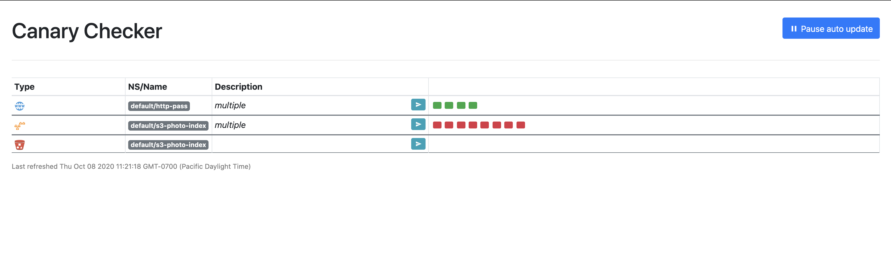

<div align="center"> </img></div>
  <p align="center">Kubernetes operator for executing synthetic tests</p>
<p align="center">
<a href="https://github.com/flanksource/canary-checker/actions"></a>
<a href="https://goreportcard.com/report/github.com/flanksource/canary-checker"></a>

<a href="https://canary-checker.docs.flanksource.com">  </a>
</p>


---
<!--ts-->
  * [Introduction](#introduction)
  * [Features](#features)
  * [Comparisons](#comparisions)
  * [Quick Start](#quick-start)
  * [Check Types](#check-types)
      * [DNS - Query a DNS server](#dns---query-a-dns-server)
      * [Containerd Pull - Pull an image using containerd](#containerd-pull---pull-an-image-using-containerd)
      * [Docker Pull - Pull an image using docker](#docker-pull---pull-an-image-using-docker)
      * [Docker Push - Create and push a docker image](#docker-push---create-and-push-a-docker-image)
      * [HTTP - Query a HTTP endpoint](#http---query-a-http-endpoint)
      * [Helm - Build and push a helm chart](#helm---build-and-push-a-helm-chart)
      * [ICMP - Ping a destination and check for packet loss](#icmp---ping-a-destination-and-check-for-packet-loss)
      * [LDAP - Query a ldap(s) server](#ldap---query-a-ldaps-server)
      * [Namespace - Create a new kubernetes namespace and pod](#namespace---create-a-new-kubernetes-namespace-and-pod)
      * [Pod - Create a new pod and verify reachability](#pod---create-a-new-pod-and-verify-reachability)
      * [Postgres - Query a Postgresql DB using SQL](#postgres---query-a-postgresql-db-using-sql)
      * [S3 - Verify reachability and correctness of an S3 compatible store](#s3---verify-reachability-and-correctness-of-an-s3-compatible-store)
      * [S3 Bucket - Query the contents of an S3 bucket for freshness](#s3-bucket---query-the-contents-of-an-s3-bucket-for-freshness)
      * [SSL - Verify the expiry date of a SSL cert](#ssl---verify-the-expiry-date-of-a-ssl-cert)
      * [TCP](#tcp)

<!--te-->

## Introduction

Canary Checker is a Kubernetes native multi-tenant synthetic monitoring system.  To learn more, please see the [official documentation](https://canary-checker.docs.flanksource.com).

## Features

* Built-in UI/Dashboard with multi-cluster aggregation
* CRD based configuration and status reporting
* Prometheus Integration
* Runnable as a CLI for once-off checks or as a standalone server outside kubernetes
* Many built-in check types


## Comparisons

| App                                                     | Comparison                                                   |
| ------------------------------------------------------- | ------------------------------------------------------------ |
| Prometheus                                              | canary-checker is not a replacement for prometheus, rather a companion. While prometheus provides persistent time series storage, canary-checker only has a small in-memory cache of recent checks.  Canary-checker also exposes metrics via `/metrics` that are scraped by prometheus. |
| Grafana                                                 | The built-in UI provides a mechanism to display check results across 1 or more instances without a dependency on grafana/prometheus running. The UI  will also display long-term graphs of check results by quering prometheus. |
| [Kuberhealthy](https://github.com/Comcast/kuberhealthy) | Very similar goals, but Kuberhealthy relies on external containers to implement checks and does not provide a UI or multi-cluster/instance aggregation. |
| [Cloudprober](https://cloudprober.org/)                 | Very similar goals, but Cloudprober is designed for very high scale, not multi-tenancy. Only has ICMP,DNS,HTTP,UDP built-in checks. |

## Quick Start

Before installing the Canary Checker, please ensure you have the [prerequisites installed](docs/prereqs.md) on your Kubernetes cluster including the [Prometheus Operator](https://github.com/prometheus-operator/prometheus-operator). 


```bash
# install the operator
kubectl apply -f https://github.com/flanksource/canary-checker/releases/download/v0.13.5/release.yaml
# deploy a sample canary
kubectl apply -f https://raw.githubusercontent.com/flanksource/canary-checker/master/fixtures-crd/http_pass.yaml
# check the results of the canary
kubectl get canary
```

`sample output`

```
NAMESPACE         NAME   INTERVAL   STATUS   MESSAGE   UPTIME 1H      LATENCY 1H   LAST TRANSITIONED   LAST CHECK
platform-system   dns    30         Passed             0/2 (0%)                                        6s
platform-system   lan    30         Passed             12/12 (100%)   1033         139m                6s
platform-system   ldap   30         Passed             5/5 (100%)     323                              1s
platform-system   pod    120        Passed             1/2 (50%)      10904        45m                 24s
platform-system   s3     30         Passed             5/5 (100%)     1091         5m35s               5s
```

`http_pass.yaml`

```yaml
apiVersion: canaries.flanksource.com/v1
kind: Canary
metadata:
  name: http-pass
spec:
  interval: 30
  http:
    - endpoint: https://httpstat.us/200
      thresholdMillis: 3000
      responseCodes: [201, 200, 301]
      responseContent: ""
      maxSSLExpiry: 7
```


## Check Types


### DNS - Query a DNS server

```yaml
dns:
  - server: 8.8.8.8
    port: 53
    query: "flanksource.com"
    querytype: "A"
    minrecords: 1
    exactreply: ["34.65.228.161"]
    timeout: 10
```

| Field | Description | Scheme | Required |
| ----- | ----------- | ------ | -------- |
| description |  | string | Yes |
| server |  | string | Yes |
| port |  | int | Yes |
| query |  | string |  |
| querytype |  | string | Yes |
| minrecords |  | int |  |
| exactreply |  | []string |  |
| timeout |  | int | Yes |
| thresholdMillis |  | int | Yes |

### Containerd Pull - Pull an image using containerd

This check will try to pull a Docker image from specified registry using containers and then verify it's checksum and size.

```yaml
containerdPull:
  - image: docker.io/library/busybox:1.31.1
    username:
    password:
    expectedDigest: 6915be4043561d64e0ab0f8f098dc2ac48e077fe23f488ac24b665166898115a
    expectedSize: 1219782
```

| Field          | Description | Scheme | Required |
| -------------- | ----------- | ------ | -------- |
| description    |             | string | Yes      |
| image          |             | string | Yes      |
| username       |             | string | Yes      |
| password       |             | string | Yes      |
| expectedDigest |             | string | Yes      |
| expectedSize   |             | int64  | Yes      |

### Docker Pull - Pull an image using docker

This check will try to pull a Docker image from specified registry, verify it's checksum and size.

```yaml

docker:
  - image: docker.io/library/busybox:1.31.1
    username:
    password:
    expectedDigest: 6915be4043561d64e0ab0f8f098dc2ac48e077fe23f488ac24b665166898115a
    expectedSize: 1219782
```

| Field | Description | Scheme | Required |
| ----- | ----------- | ------ | -------- |
| description |  | string | Yes |
| image |  | string | Yes |
| username |  | string | Yes |
| password |  | string | Yes |
| expectedDigest |  | string | Yes |
| expectedSize |  | int64 | Yes |


### Docker Push - Create and push a docker image

| Field | Description | Scheme | Required |
| ----- | ----------- | ------ | -------- |
| description |  | string | Yes |
| image |  | string | Yes |
| username |  | string | Yes |
| password |  | string | Yes |


### HTTP - Query a HTTP endpoint

```yaml
http:
  - endpoint: https://httpstat.us/200
    thresholdMillis: 3000
    responseCodes: [201,200,301]
    responseContent: ""
    maxSSLExpiry: 60
  - endpoint: https://httpstat.us/500
    thresholdMillis: 3000
    responseCodes: [500]
    responseContent: ""
    maxSSLExpiry: 60
  - endpoint: https://httpstat.us/500
    thresholdMillis: 3000
    responseCodes: [302]
    responseContent: ""
    maxSSLExpiry: 60
```

| Field | Description | Scheme | Required |
| ----- | ----------- | ------ | -------- |
| description |  | string | Yes |
| endpoint | HTTP endpoint to crawl | string | Yes |
| thresholdMillis | Maximum duration in milliseconds for the HTTP request. It will fail the check if it takes longer. | int | Yes |
| responseCodes | Expected response codes for the HTTP Request. | []int | Yes |
| responseContent | Exact response content expected to be returned by the endpoint. | string | Yes |
| maxSSLExpiry | Maximum number of days until the SSL Certificate expires. | int | Yes |


### Helm - Build and push a helm chart

| Field | Description | Scheme | Required |
| ----- | ----------- | ------ | -------- |
| description |  | string | Yes |
| chartmuseum |  | string | Yes |
| project |  | string |  |
| username |  | string | Yes |
| password |  | string | Yes |
| cafile |  | *string |  |


### ICMP - Ping a destination and check for packet loss

This test will check ICMP packet loss and duration.

```yaml
icmp:
  - endpoints:
      - https://google.com
      - https://yahoo.com
    thresholdMillis: 400
    packetLossThreshold: 0.5
    packetCount: 2
```

| Field | Description | Scheme | Required |
| ----- | ----------- | ------ | -------- |
| description |  | string | Yes |
| endpoint |  | string | Yes |
| thresholdMillis |  | int64 | Yes |
| packetLossThreshold |  | int64 | Yes |
| packetCount |  | int | Yes |


### LDAP - Query a ldap(s) server

The LDAP check will:

* bind using provided user/password to the ldap host. Supports ldap/ldaps protocols.
* search an object type in the provided bind DN.s

```yaml

ldap:
  - host: ldap://127.0.0.1:10389
    username: uid=admin,ou=system
    password: secret
    bindDN: ou=users,dc=example,dc=com
    userSearch: "(&(objectClass=organizationalPerson))"
  - host: ldap://127.0.0.1:10389
    username: uid=admin,ou=system
    password: secret
    bindDN: ou=groups,dc=example,dc=com
    userSearch: "(&(objectClass=groupOfNames))"
```

| Field | Description | Scheme | Required |
| ----- | ----------- | ------ | -------- |
| description |  | string | Yes |
| host |  | string | Yes |
| username |  | string | Yes |
| password |  | string | Yes |
| bindDN |  | string | Yes |
| userSearch |  | string | Yes |
| skipTLSVerify |  | bool | Yes |


### Namespace - Create a new kubernetes namespace and pod

The Namespace check will:

* create a new namespace using the labels/annotations provided

```yaml

namespace:
  - namePrefix: "test-name-prefix-"
    labels:
      team: test
    annotations:
      "foo.baz.com/foo": "bar"
```

| Field | Description | Scheme | Required |
| ----- | ----------- | ------ | -------- |
| description |  | string | Yes |
| checkName |  | string | Yes |
| namespaceNamePrefix |  | string | Yes |
| namespaceLabels |  | map[string]string | Yes |
| namespaceAnnotations |  | map[string]string | Yes |
| podSpec |  | string | Yes |
| scheduleTimeout |  | int64 | Yes |
| readyTimeout |  | int64 | Yes |
| httpTimeout |  | int64 | Yes |
| deleteTimeout |  | int64 | Yes |
| ingressTimeout |  | int64 | Yes |
| httpRetryInterval |  | int64 | Yes |
| deadline |  | int64 | Yes |
| port |  | int64 | Yes |
| path |  | string | Yes |
| ingressName |  | string | Yes |
| ingressHost |  | string | Yes |
| expectedContent |  | string | Yes |
| expectedHttpStatuses |  | []int64 | Yes |
| priorityClass |  | string | Yes |


### Pod - Create a new pod and verify reachability

```yaml
pod:
  - name: golang
    namespace: default
    spec: |
      apiVersion: v1
      kind: Pod
      metadata:
        name: hello-world-golang
        namespace: default
        labels:
          app: hello-world-golang
      spec:
        containers:
          - name: hello
            image: quay.io/toni0/hello-webserver-golang:latest
    port: 8080
    path: /foo/bar
    ingressName: hello-world-golang
    ingressHost: "hello-world-golang.127.0.0.1.nip.io"
    scheduleTimeout: 2000
    readyTimeout: 5000
    httpTimeout: 2000
    deleteTimeout: 12000
    ingressTimeout: 5000
    deadline: 29000
    httpRetryInterval: 200
    expectedContent: bar
    expectedHttpStatuses: [200, 201, 202]
```

| Field | Description | Scheme | Required |
| ----- | ----------- | ------ | -------- |
| description |  | string | Yes |
| name |  | string | Yes |
| namespace |  | string | Yes |
| spec |  | string | Yes |
| scheduleTimeout |  | int64 | Yes |
| readyTimeout |  | int64 | Yes |
| httpTimeout |  | int64 | Yes |
| deleteTimeout |  | int64 | Yes |
| ingressTimeout |  | int64 | Yes |
| httpRetryInterval |  | int64 | Yes |
| deadline |  | int64 | Yes |
| port |  | int64 | Yes |
| path |  | string | Yes |
| ingressName |  | string | Yes |
| ingressHost |  | string | Yes |
| expectedContent |  | string | Yes |
| expectedHttpStatuses |  | []int | Yes |
| priorityClass |  | string | Yes |


### Postgres - Query a Postgresql DB using SQL

This check will try to connect to a specified Postgresql database, run a query against it and verify the results.

```yaml

postgres:
  - connection: "user=postgres password=mysecretpassword host=192.168.0.103 port=15432 dbname=postgres sslmode=disable"
    query:  "SELECT 1"
    results: 1
```

| Field | Description | Scheme | Required |
| ----- | ----------- | ------ | -------- |
| description |  | string | Yes |
| driver |  | string | Yes |
| connection |  | string | Yes |
| query |  | string | Yes |
| results |  | int | Yes |


### S3 - Verify reachability and correctness of an S3 compatible store

This check will:

* list objects in the bucket to check for Read permissions
* PUT an object into the bucket for Write permissions
* download previous uploaded object to check for Get permissions

```yaml

s3:
  - buckets:
      - name: "test-bucket"
        region: "us-east-1"
        endpoint: "https://test-bucket.s3.us-east-1.amazonaws.com"
    secretKey: "<access-key>"
    accessKey: "<secret-key>"
    objectPath: "path/to/object"
```

| Field | Description | Scheme | Required |
| ----- | ----------- | ------ | -------- |
| description |  | string | Yes |
| bucket |  | [Bucket](#bucket) | Yes |
| accessKey |  | string | Yes |
| secretKey |  | string | Yes |
| objectPath |  | string | Yes |
| skipTLSVerify | Skip TLS verify when connecting to s3 | bool | Yes |


### S3 Bucket - Query the contents of an S3 bucket for freshness

This check will

- search objects matching the provided object path pattern
- check that latest object is no older than provided MaxAge value in seconds
- check that latest object size is not smaller than provided MinSize value in bytes.

```yaml
s3Bucket:
  - bucket: foo
    accessKey: "<access-key>"
    secretKey: "<secret-key>"
    region: "us-east-2"
    endpoint: "https://s3.us-east-2.amazonaws.com"
    objectPath: "(.*)archive.zip$"
    readWrite: true
    maxAge: 5000000
    minSize: 50000
```

| Field | Description | Scheme | Required |
| ----- | ----------- | ------ | -------- |
| description |  | string | Yes |
| bucket |  | string | Yes |
| accessKey |  | string | Yes |
| secretKey |  | string | Yes |
| region |  | string | Yes |
| endpoint |  | string | Yes |
| objectPath | glob path to restrict matches to a subset | string | Yes |
| readWrite |  | bool | Yes |
| maxAge | maximum allowed age of matched objects in seconds | int64 | Yes |
| minSize | min size of of most recent matched object in bytes | int64 | Yes |
| usePathStyle | Use path style path: http://s3.amazonaws.com/BUCKET/KEY instead of http://BUCKET.s3.amazonaws.com/KEY | bool | Yes |
| skipTLSVerify | Skip TLS verify when connecting to s3 | bool | Yes |


### SSL - Verify the expiry date of a SSL cert

| Field | Description | Scheme | Required |
| ----- | ----------- | ------ | -------- |
| description |  | string | Yes |
| endpoint | HTTP endpoint to crawl | string | Yes |
| maxSSLExpiry | Maximum number of days until the SSL Certificate expires. | int | Yes |


### TCP

| Field | Description | Scheme | Required |
| ----- | ----------- | ------ | -------- |
| description |  | string | Yes |
| endpoint |  | string | Yes |
| thresholdMillis |  | int64 | Yes |

